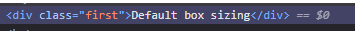
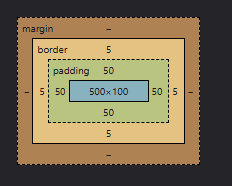
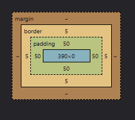
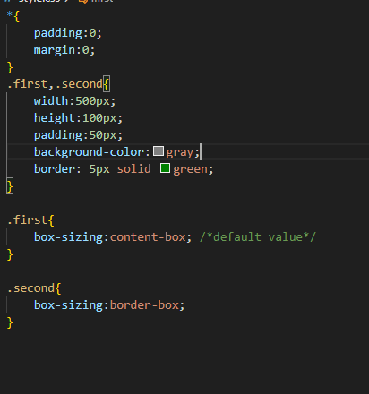
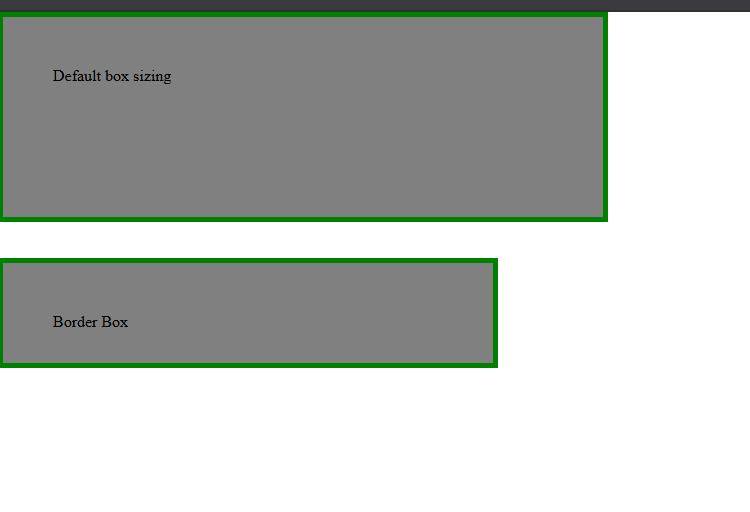

# Odin

## Command Line
- . represents current directory
- .. represents parent directory

## Copy File
- cp file-to-copy file-to-copy ........... location-to-copy

## Rename File/ Move file to another directory
- mv file
-mv file dummy/

## Wildcard
- (*) Any
- (?) Only one

### Wildcar Questions
- 1)Sam has a directory containing calibration data, datasets, and descriptions of the datasets:
```bash
├── 2015-10-23-calibration.txt
├── 2015-10-23-dataset1.txt
├── 2015-10-23-dataset2.txt
├── 2015-10-23-dataset_overview.txt
├── 2015-10-26-calibration.txt
├── 2015-10-26-dataset1.txt
├── 2015-10-26-dataset2.txt
├── 2015-10-26-dataset_overview.txt
├── 2015-11-23-calibration.txt
├── 2015-11-23-dataset1.txt
├── 2015-11-23-dataset2.txt
├── 2015-11-23-dataset_overview.txt
├── backup
│   ├── calibration
│   └── datasets
└── send_to_bob
    ├── all_datasets_created_on_a_23rd
    └── all_november_files

```
Before heading off to another field trip, she wants to back up her data and send some datasets to her colleague Bob. Sam uses the following commands to get the job done:

```bash
$ cp *dataset* backup/datasets
$ cp ____calibration____ backup/calibration
$ cp 2015-____-____ send_to_bob/all_november_files/
$ cp ____ send_to_bob/all_datasets_created_on_a_23rd/
```
Help Sam by filling in the blanks.

The resulting directory structure should look like this:

#### Expected Outcome
```bash
.
├── 2015-10-23-calibration.txt
├── 2015-10-23-dataset1.txt
├── 2015-10-23-dataset2.txt
├── 2015-10-23-dataset_overview.txt
├── 2015-10-26-calibration.txt
├── 2015-10-26-dataset1.txt
├── 2015-10-26-dataset2.txt
├── 2015-10-26-dataset_overview.txt
├── 2015-11-23-calibration.txt
├── 2015-11-23-dataset1.txt
├── 2015-11-23-dataset2.txt
├── 2015-11-23-dataset_overview.txt
├── backup
│   ├── calibration
│   │   ├── 2015-10-23-calibration.txt
│   │   ├── 2015-10-26-calibration.txt
│   │   └── 2015-11-23-calibration.txt
│   └── datasets
│       ├── 2015-10-23-dataset1.txt
│       ├── 2015-10-23-dataset2.txt
│       ├── 2015-10-23-dataset_overview.txt
│       ├── 2015-10-26-dataset1.txt
│       ├── 2015-10-26-dataset2.txt
│       ├── 2015-10-26-dataset_overview.txt
│       ├── 2015-11-23-dataset1.txt
│       ├── 2015-11-23-dataset2.txt
│       └── 2015-11-23-dataset_overview.txt
└── send_to_bob
    ├── all_datasets_created_on_a_23rd
    │   ├── 2015-10-23-dataset1.txt
    │   ├── 2015-10-23-dataset2.txt
    │   ├── 2015-10-23-dataset_overview.txt
    │   ├── 2015-11-23-dataset1.txt
    │   ├── 2015-11-23-dataset2.txt
    │   └── 2015-11-23-dataset_overview.txt
    └── all_november_files
        ├── 2015-11-23-calibration.txt
        ├── 2015-11-23-dataset1.txt
        ├── 2015-11-23-dataset2.txt
        └── 2015-11-23-dataset_overview.txt
```

### Solution:
```bash
  cp *dataset* backup/dataset 
  cp *calibration* backup/calibration
  cp 2015-11-* send_to_bob/all_november_files/
  cp *23-dataset* send_to_bob/all_datasets_created_on_a_23rd/
```
### 2) Organizing Directories And Files
  Jamie is working on a project, and she sees that her files aren’t very well organized:
```bash
ls -F
 analyzed/ fructose.dat raw/ sucrose.dat
```

The fructose.dat and sucrose.dat files contain output from her data analysis. What command(s) covered in this lesson does she need to run so that the commands below will produce the output shown?
```bash
ls -F
 analyzed/ raw/
ls analyzed
 fructose.dat  sucrose.dat
```

### Solution:
```bash
mv *.dat analyzed
```

### 3) Reproduce a folder structure

You’re starting a new experiment and would like to duplicate the directory structure from your previous experiment so you can add new data.

Assume that the previous experiment is in a folder called 2016-05-18, which contains a data folder that in turn contains folders named raw and processed that contain data files. The goal is to copy the folder structure of the 2016-05-18 folder into a folder called 2016-05-20 so that your final directory structure looks like this:

```bash
2016-05-20/
└── data
   ├── processed
   └── raw
```
Which of the following set of commands would achieve this objective? What would the other commands do?
```bash
$ mkdir 2016-05-20
$ mkdir 2016-05-20/data
$ mkdir 2016-05-20/data/processed
$ mkdir 2016-05-20/data/raw
```
- Achieves goal using relative path.


```bash
$ mkdir 2016-05-20
$ cd 2016-05-20
$ mkdir data
$ cd data
$ mkdir raw processed
```
- Achieves goal using absolute path.


```bash
$ mkdir 2016-05-20/data/raw
$ mkdir 2016-05-20/data/processed
```
- Throws error because one cannot create directory along with sub directory in one command using only mkdir.


```bash
$ mkdir -p 2016-05-20/data/raw
$ mkdir -p 2016-05-20/data/processed
```
- Achieves the goal by overcomming the issue above by using -p option which allow mkdir to create directory along with subdirectory in single command.


```bash
$ mkdir 2016-05-20
$ cd 2016-05-20
$ mkdir data
$ mkdir raw processed
```
- Creates data,raw,processed in same directory.

## Absolute and Relative path in anchor
### Absolute Path
 - Full path to website including domains.

### Relative Path
 - Path to pages on same website.

### What is Tabnapping?
- A phishing trick where a website you opened in a new tab secretly hijacks your original site and  changes it and mimics its to look like original  when you're not looking — to steal your password when you come back to it.
- This happens because when new tab is opened by clicking link in original site the link can contain melicious js code throught which it can use window.opener.location to hijack and modify origianl site.

### How to prevent Tabnapping?
- use rel="noopener noreferrer"
#### how does this prevent tabnapping?
 - Noopener: prevents access to data of original site.
 - noreferrer: hides where you came from
 - When noreferrer and noopener are present hacker cannot use window.opener.location as noopener breaks connection between the new tab and the original tab. 


# The seven rules of great Git commit message
### - Separete commit head and body.
### - Keep Subject character limit 50 or less
### - Start subject with capitalization.
### - Do not end subject with period.
### - Use the imperative mood in the subject line.
    - Indicative mood: Reporting fact ex: Fixed bug with Y.
    - Imperative mood:Commanding tone ex: Fix bug with Y.
	- The commit subject should be able to complete following sentences.
		- If applied, this commit will fix buyg with Y ( works on imperative mood).
		- If applied, this commit will fixed bug with Y (Doesn't work with indicative mood).
### - Wrap the body  at 72 characters
### - Use the body to explain what and why vs how
    - why made change in original(what was wrong whith that).
    - the way they work now.
    - why solve it the way you did.


## CSS
### Selectors
- Universal
- Type/Element 
- class
- id
- Grouping (,)
- Chaining (class.class)
- Descendant

## Image Height and Width property and their values
 - By default height and width of image is set to the original height and width of image.
 ### Auto Value
  - Auto value is used to balance the propotion of image.
    Ex: height: auto; width:500px;
    if original height of the image was 500 and width was 1000px then with auto as value it sets height to 250px.

## Inspect Element
### Strike Through
 - When we inspect element in browser we can see a cut in css style that is being overwritten by same property.The cut is called strike through.


## Box Model
### Margin merger
 - if two element have margin in same direction the merger applies where greatest out of two margin value is applied.
 - ex: .div1 {margin-bottom:20px;} .div2{margin-top:30px;} 30px margin will be applied and 20px will be cancelled instead of both value adding up.

### box-sizing
 - The value given to this property defined if the padding,border given will be added to actual width and height or it will be managed so that it takes actual width and height instead of adding  to it.

 
Example: 
First Div element
   
   

Second Div Element
    
    

Styling:
    

outcome:
    

In the given example there are two div elements having same width and height same padding and margin and the only thing different is box sizing.
The first div is set to box-sizing:content-box; which is the default value as it can be seen that the padding and margin given is being added to existing width and height to form a new total size.

On the other hand for second div box-sizing is set to border-box and here we can see that instead of adding to existing width and height the browser manages in such a way that divides and balance width and height maintaining original width and height.
