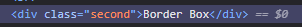

# Odin

## Command Line
- . represents current directory
- .. represents parent directory

## Copy File
- cp file-to-copy file-to-copy ........... location-to-copy

## Rename File/ Move file to another directory
- mv file
-mv file dummy/

## Wildcard
- (*) Any
- (?) Only one

### Wildcar Questions
- 1)Sam has a directory containing calibration data, datasets, and descriptions of the datasets:
```bash
├── 2015-10-23-calibration.txt
├── 2015-10-23-dataset1.txt
├── 2015-10-23-dataset2.txt
├── 2015-10-23-dataset_overview.txt
├── 2015-10-26-calibration.txt
├── 2015-10-26-dataset1.txt
├── 2015-10-26-dataset2.txt
├── 2015-10-26-dataset_overview.txt
├── 2015-11-23-calibration.txt
├── 2015-11-23-dataset1.txt
├── 2015-11-23-dataset2.txt
├── 2015-11-23-dataset_overview.txt
├── backup
│   ├── calibration
│   └── datasets
└── send_to_bob
    ├── all_datasets_created_on_a_23rd
    └── all_november_files

```
Before heading off to another field trip, she wants to back up her data and send some datasets to her colleague Bob. Sam uses the following commands to get the job done:

```bash
$ cp *dataset* backup/datasets
$ cp ____calibration____ backup/calibration
$ cp 2015-____-____ send_to_bob/all_november_files/
$ cp ____ send_to_bob/all_datasets_created_on_a_23rd/
```
Help Sam by filling in the blanks.

The resulting directory structure should look like this:

#### Expected Outcome
```bash
.
├── 2015-10-23-calibration.txt
├── 2015-10-23-dataset1.txt
├── 2015-10-23-dataset2.txt
├── 2015-10-23-dataset_overview.txt
├── 2015-10-26-calibration.txt
├── 2015-10-26-dataset1.txt
├── 2015-10-26-dataset2.txt
├── 2015-10-26-dataset_overview.txt
├── 2015-11-23-calibration.txt
├── 2015-11-23-dataset1.txt
├── 2015-11-23-dataset2.txt
├── 2015-11-23-dataset_overview.txt
├── backup
│   ├── calibration
│   │   ├── 2015-10-23-calibration.txt
│   │   ├── 2015-10-26-calibration.txt
│   │   └── 2015-11-23-calibration.txt
│   └── datasets
│       ├── 2015-10-23-dataset1.txt
│       ├── 2015-10-23-dataset2.txt
│       ├── 2015-10-23-dataset_overview.txt
│       ├── 2015-10-26-dataset1.txt
│       ├── 2015-10-26-dataset2.txt
│       ├── 2015-10-26-dataset_overview.txt
│       ├── 2015-11-23-dataset1.txt
│       ├── 2015-11-23-dataset2.txt
│       └── 2015-11-23-dataset_overview.txt
└── send_to_bob
    ├── all_datasets_created_on_a_23rd
    │   ├── 2015-10-23-dataset1.txt
    │   ├── 2015-10-23-dataset2.txt
    │   ├── 2015-10-23-dataset_overview.txt
    │   ├── 2015-11-23-dataset1.txt
    │   ├── 2015-11-23-dataset2.txt
    │   └── 2015-11-23-dataset_overview.txt
    └── all_november_files
        ├── 2015-11-23-calibration.txt
        ├── 2015-11-23-dataset1.txt
        ├── 2015-11-23-dataset2.txt
        └── 2015-11-23-dataset_overview.txt
```

### Solution:
```bash
  cp *dataset* backup/dataset 
  cp *calibration* backup/calibration
  cp 2015-11-* send_to_bob/all_november_files/
  cp *23-dataset* send_to_bob/all_datasets_created_on_a_23rd/
```
### 2) Organizing Directories And Files
  Jamie is working on a project, and she sees that her files aren’t very well organized:
```bash
ls -F
 analyzed/ fructose.dat raw/ sucrose.dat
```

The fructose.dat and sucrose.dat files contain output from her data analysis. What command(s) covered in this lesson does she need to run so that the commands below will produce the output shown?
```bash
ls -F
 analyzed/ raw/
ls analyzed
 fructose.dat  sucrose.dat
```

### Solution:
```bash
mv *.dat analyzed
```

### 3) Reproduce a folder structure

You’re starting a new experiment and would like to duplicate the directory structure from your previous experiment so you can add new data.

Assume that the previous experiment is in a folder called 2016-05-18, which contains a data folder that in turn contains folders named raw and processed that contain data files. The goal is to copy the folder structure of the 2016-05-18 folder into a folder called 2016-05-20 so that your final directory structure looks like this:

```bash
2016-05-20/
└── data
   ├── processed
   └── raw
```
Which of the following set of commands would achieve this objective? What would the other commands do?
```bash
$ mkdir 2016-05-20
$ mkdir 2016-05-20/data
$ mkdir 2016-05-20/data/processed
$ mkdir 2016-05-20/data/raw
```
- Achieves goal using relative path.


```bash
$ mkdir 2016-05-20
$ cd 2016-05-20
$ mkdir data
$ cd data
$ mkdir raw processed
```
- Achieves goal using absolute path.


```bash
$ mkdir 2016-05-20/data/raw
$ mkdir 2016-05-20/data/processed
```
- Throws error because one cannot create directory along with sub directory in one command using only mkdir.


```bash
$ mkdir -p 2016-05-20/data/raw
$ mkdir -p 2016-05-20/data/processed
```
- Achieves the goal by overcomming the issue above by using -p option which allow mkdir to create directory along with subdirectory in single command.


```bash
$ mkdir 2016-05-20
$ cd 2016-05-20
$ mkdir data
$ mkdir raw processed
```
- Creates data,raw,processed in same directory.

## Absolute and Relative path in anchor
### Absolute Path
 - Full path to website including domains.

### Relative Path
 - Path to pages on same website.

### What is Tabnapping?
- A phishing trick where a website you opened in a new tab secretly hijacks your original site and  changes it and mimics its to look like original  when you're not looking — to steal your password when you come back to it.
- This happens because when new tab is opened by clicking link in original site the link can contain melicious js code throught which it can use window.opener.location to hijack and modify origianl site.

### How to prevent Tabnapping?
- use rel="noopener noreferrer"
#### how does this prevent tabnapping?
 - Noopener: prevents access to data of original site.
 - noreferrer: hides where you came from
 - When noreferrer and noopener are present hacker cannot use window.opener.location as noopener breaks connection between the new tab and the original tab. 


# The seven rules of great Git commit message
### - Separete commit head and body.
### - Keep Subject character limit 50 or less
### - Start subject with capitalization.
### - Do not end subject with period.
### - Use the imperative mood in the subject line.
    - Indicative mood: Reporting fact ex: Fixed bug with Y.
    - Imperative mood:Commanding tone ex: Fix bug with Y.
	- The commit subject should be able to complete following sentences.
		- If applied, this commit will fix buyg with Y ( works on imperative mood).
		- If applied, this commit will fixed bug with Y (Doesn't work with indicative mood).
### - Wrap the body  at 72 characters
### - Use the body to explain what and why vs how
    - why made change in original(what was wrong whith that).
    - the way they work now.
    - why solve it the way you did.


## CSS
### Selectors
- Universal
- Type/Element 
- class
- id
- Grouping (,)
- Chaining (class.class)
- Descendant

## Image Height and Width property and their values
 - By default height and width of image is set to the original height and width of image.
 ### Auto Value
  - Auto value is used to balance the propotion of image.
    Ex: height: auto; width:500px;
    if original height of the image was 500 and width was 1000px then with auto as value it sets height to 250px.

## Inspect Element
### Strike Through
 - When we inspect element in browser we can see a cut in css style that is being overwritten by same property.The cut is called strike through.


## Box Model
### Margin collapsing
- Depending on whether two elements whose margins touch have positive or negative margins, the results will be different:

- Two positive margins will combine to become one margin. Its size will be equal to the largest individual margin.
- Two negative margins will collapse and the smallest (furthest from zero) value will be used.
If one margin is negative, its value will be subtracted from the total.

### box-sizing
 - The value given to this property defined if the padding,border given will be added to actual width and height or it will be managed so that it takes actual width and height instead of adding  to it.

 
Example: 
First Div element
   - 
   - 


Second Div Element
  - 
  - 


Styling:
  - 


outcome:
  - 


In the given example there are two div elements having same width and height same padding and margin and the only thing different is box sizing.

The first div is set to box-sizing:content-box; which is the default value as it can be seen that the padding and margin given is being added to existing width and height to form a new total size.

On the other hand for second div box-sizing is set to border-box and here we can see that instead of adding to existing width and height the browser manages in such a way that divides and balance width and height maintaining original width and height.

Box Sizing Source: https://www.youtube.com/watch?v=HdZHcFWcAd8

### Inline and Block elements
#### Inline Elements
  - Doesn't respect width and height.
  - Doesn't push other elements when applied top/bottom padding,margin,border.
  - Pushes elemets around it when applied left/right padding,margin,border.
  - No default line break.

#### Block Elements
   - Respect width and height.
   - Pushesh other elements when applied padding,margin,border.
   - Default Line break.

#### Inline-Block
  - Display:inline-block;
  - Respects width and height.
  - No line break.
  - Pushesh other elements when applied padding,margin,border.

## Revision Task I
##### Tasl 1: In this task, there are two boxes below, one is using the standard box model, the other the alternate box model. Change the width of the second box by adding declarations to the .alternate class, so that it matches the visual width of the first box.

###### HTML 
<div class="box">I use the standard box model.</div>
<div class="box alternate">I use the alternate box model.</div>

###### Css
body {
  font: 1.2em / 1.5 sans-serif;
}
.box {
  border: 5px solid rebeccapurple;
  background-color: lightgray;
  padding: 40px;
  margin: 40px;
  width: 300px;
  height: 150px;
}

.alternate {
  box-sizing: border-box;
}

##### Task 2: In this task, the inline element has a margin, padding and border. However, the lines above and below are overlapping it. What can you add to your CSS to cause the size of the margin, padding, and border to be respected by the other lines, while still keeping the element inline?

###### HTML
<div class="box">
  <p>
    Veggies es bonus vobis, <span>proinde vos postulo</span> essum magis
    kohlrabi welsh onion daikon amaranth tatsoi tomatillo melon azuki bean
    garlic.
  </p>

  <p>
    Gumbo beet greens corn soko endive gumbo gourd. Parsley shallot courgette
    tatsoi pea sprouts fava bean collard greens dandelion okra wakame tomato.
    Dandelion cucumber earthnut pea peanut soko zucchini.
  </p>
</div>

###### CSS
body {
  font: 1.2em / 1.5 sans-serif;
}

.box span {
  background-color: pink;
  border: 5px solid black;
  padding: 1em;
}

Inline/Block display source : https://developer.mozilla.org/en-US/docs/Learn_web_development/Core/Styling_basics/Box_model


## Margin
### Margin defining ways
 - margin:top right bottom left;
 - margin:top-right bottom-left
 - margin: top right-bottom left;

 ### Margin Auto and centering
  - Auto is only usefule for horizontal centering.
  - The width needs to be defined for this to work.
  - if width is not defined or it is not intended for horizontal centring it will have no effect.

  Learning Source: https://css-tricks.com/almanac/properties/m/margin/

  ## Flex Box
   - flex:1; is a short hand form of flex-grow, flex-shirnk and flex-basis
   - when flex:1; is set it represents flex-grow:1;, flex-shirnk:1; and flex-basis:0;

   ### What is flex grow,shrink and basis
    - flex grow,shirk and basis are used to define how the item inside flex container grows or shrink with respect to or no respect to its width and height.

  #### flex grow
      - flex grow defines how the items will grow according to extra flex space available(unoccupied flex cells).
      - flex-grow:1; means all the item will grow in equal proportion.
      - if an item is set to flex-grow:2; then it means respective item will grow X2 times more than other items.

  #### flex shrink
      - same as grow but for shrinking.
      - This triggers only when the width of container becomes less than the collective width of items.
      - to adjust with the new view window it shrinks as per the specified value.
      - same as for grow in shrink it shrinks x2 time more than other item if set flex-shrink:2;


  #### flex basis
      - The value of flex basis defines the initial size of item before grow or shrink.
      - default value flex: 0 1 auto; means that flex-grow is 0 , flex-shrink is 1 and flex-basis is auto
          * What this does is that the flex items doesnt expand to take up remaining flex space but shrink is allowed to adjust the items.
          * flex basis to auto takes the width value initiated to the item as initial start before grow and shrink
      - flex: 1 1 0; this is used when all the item need to be shown as shame size irrespective of the size of content inside them.
          * while 1 and 1 allow grow and shrink 0 is the main thing to consider as it signifies no fixed initial size so with flex grow set to 1 the items will be adjusted evenly to fill the gap.


  ### Max and min content
      - width:max-content ensures that an element will never be larger than its container.
      - width:min-content ensures that an element will never be smaller than the content inside it.It achieves that by allocating the size of the longest content size to all other sizes.

  ### justify content and align item
      Before diving into concept of justify content and align item some core knowledge like main axis and cross axis.

      #### Main axis
      - Main axis is the direction in which the flex is flowing.if set to row then row is main axis.

      #### cross axis 
      - Cross axis is the opposite axis of the direction set to flex. 

    - so if direction of flex is row then row is main axis and column is cross axis.

     #### justify content
     - justify content is the flex property used to justify position of items inside container in direction specified in flex.
     - ex: justify-content:center;flex-direction:row; position the flex items in the center horizontally if any space available.
     
     #### align item
     - align item is the flex property used to set positioning of items in cross axis.
     - it also have align-self property to define individual positioning of an item.


     align-item:stretch is default value of align-item which streaches the content to distribute the content size evenly.

     ### Flex axis knowledge check(Answer on you own word.)
     #### How do you make flex items arrange themselves vertically instead of horizontally?
     #### In a column flex-container, what does flex-basis refer to?
     #### In a row flex-container, what does flex-basis refer to?
     #### why do the previous two question shave different answers?


    ### Align-content,order,align-self,flex-direction,flex-wrap,flex-flow

    #### Align-content
      - align content is used to manage spacing between items

    ### order
      - order is used in items of flex container and by default contains value 0;
      - value more than zero leads to an item placed at the end of the specified direction if it is the highest order.

    ### align-self
      - used to align an item independent of others.

    ### flex-direction: column-reverse,row-reverse
        - column and row reverse flips the items in the respective direction.
        - This also changes the direction prospective.

    ### flex-wrap: nowrap, wrap, wrap-reverse
        - wrap allow content to wrap to fit the shrinking container.
        - nowrap as name suggest doesnt allow content to wrap.
        - wrap-reverse wraps the content and flip them in specified direction.

    ### flex-flow
        - due to flex direction and flex wrap being very often used new property was introduced which allow defining of both in one line.
        - flex-flow: direction wrap;


    ## Javascript
    ### Template literal
      - Can embed js
      - can declare over multiple lines.

    ### Falsy and Truthy value
      - values that are false by default like 0,"",null,undefined,NaN are Falsy value.
      - values other than these are truthy.

    ### Debugger in devtool


## JS Function Skill Test 1: https://developer.mozilla.org/en-US/docs/Learn_web_development/Core/Scripting/Test_your_skills/Functions


## Call Stack
 - Global Call stack
 - function call stack.


## Errors
### Syntax Error
### Reference Error
### Type Error

## 10 Principles of clean code
- Revise your logic before coding(pseudo).
- Clearly expose the sturcture of the page(hierarcy).
- Use correct and consistent indentation.
- Write explanatory comments if necessary only.
- Avoid misusing comments.
- Avoid extremely large function(Break it down).
- Use naming standards for functions and variables
    - Camel case,start with noun,meaningful/relevent naming,ALLCAPS_WITHUNDERSCORE if consistent/fixed value.
    - line break after every 80 character.
    - line break after operator.

- Treat changes with caution.
- Avodi indiscriminate mixing of coding language(avoid inline css,jumbled js).
- Summarize you imports (many links embedded in one).


## Some useful array methods
### Non destructive methods
 - at()
 - join()
 - concat()
 - flatMap()
 - toSplice(position of new element,how many item to remove,new elements,new elements......)
 - slice()

### Destructive methods
  - pop()-from last
  - push()-from last
  - shift()-from first
  - unshift()-from first
  - delete()-leaves undefined array slot.
  - copyWithin()-copies element in desired position.
  - splice(position of new element,how many item to remove,new elements,new elements......)

## Test Driven Development(TDD)

## Reduce()
Example: const findTheOldest = function(people){
    return people.reduce((oldPerson,newPerson)=>{
      const oldAge = age(oldPerson.yearOfBirth,oldPerson.yearOfDeath);
      const newAge = age(newPerson.yearOfBirth,newPerson.yearOfDeath);
      return newAge > oldAge?newPerson:oldPerson;
    });
  }
  
  function age(birth,death){
    if(!death){
        death = new Date().getFullYear();
    }
    return death - birth;
  }

## DOM Manipulation
### Query selector
    parentNode.querySelectorAll(selector) returns node list of all the matches of selector(not array).

### Append elements
  parentNode.insertBefore(newNode, referenceNode) - inserts new node into parent node before reference node.

### Risk of using innerHTML more often(JS Injection).
        <!DOCTYPE html>
        <html lang="en">
        <head>
            <meta charset="UTF-8">
            <meta name="viewport" content="width=device-width, initial-scale=1.0">
            <title>Document</title>
            <link rel="stylesheet" href="style.css">
        </head>
        <body>
        <div id="container">
        <input type="text" id="input" placeholder="Enter here"/>
        <button id="submit">submit</button>
        <button id="saveCookie">Save Cookie</button>
        <div id="outputContainer"></div>
        </div>
        </body>
        <script>
            let container = document.getElementById('outputContainer');
            let submit = document.getElementById('submit');
            let saveCookie = document.getElementById('saveCookie');
            submit.addEventListener('click',()=>{
                let input = document.getElementById('input');
                container.innerText ="<label>"+input.value+"</label>";
            });
            saveCookie.addEventListener('click', () => {
            document.cookie = "username=" + encodeURIComponent("John Doe") + "; expires=Tue, 29 Apr 2025 12:00:00 UTC; path=/";
            document.cookie = "password=" + encodeURIComponent("someone") + "; expires=Tue, 29 Apr 2025 12:00:00 UTC; path=/";
        });


        </script>
        </html>


## Event bubbling,capturing ,Propagation
-> Event bubbling and capturing is the concept of how nested event listener work / flow of event trigger.

### Default behaviour of listener
-> in capturing process the program identifies all the elements(parent,childs) from top to bottom.
-> in bubbling process the events are triggered from child most to parent most.

(Note: addEventListener takes three parameter (event,function,useCaptureBooleanValue)   and useCaptureBooleanValue is by default false)

### DEMO of different outcome while clicking on child element.
#### HTML
    <!DOCTYPE html>
    <html lang="en-US">
      <head>
        <meta charset="utf-8">
        <meta name="viewport" content="width=device-width, initial-scale=1.0">
        <title>Simple DOM example</title>
        <style>
          .grandParent{
            width:500px;
            height:500px;
            background-color: red;
          }
          .parent{
            width:200px;
            height:200px;
            background-color: green;
          }
          .child{
            width:100px;
            height:100px;
            background-color: blue;
          }
        </style>
      </head>
      <body>
            <div class="grandParent">
              <div class="parent">
                <div class="child">

                </div>
              </div>
            </div>

#### Default behaviour

        let divs = document.querySelectorAll('div');

        divs.forEach(div => div.addEventListener('click',(e)=>{
          console.log(e.currentTarget.classList.value);
        }));


#### With useCapture set to true
        let divs = document.querySelectorAll('div');

        divs.forEach(div => div.addEventListener('click',(e)=>{
          console.log(e.currentTarget.classList.value);
        },true));


#### With useCapture false and stopPropagation

        divs.forEach(div => div.addEventListener('click',(e)=>{
          e.stopPropagation();
          console.log(e.currentTarget.classList.value);
        }));


